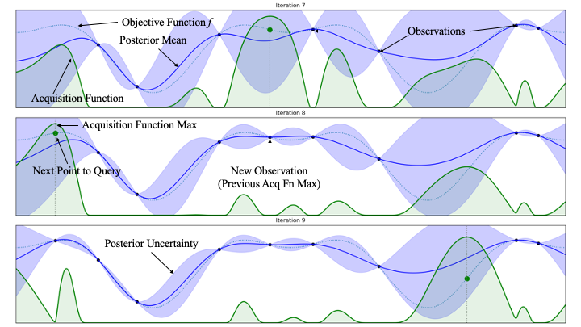

# Basics of Bayesian Optimization

## Fundamental concepts

Bayesian Optimization (BO) is a statistical method to optimize an objective function f over some feasible search space 𝕏. For example, f could be the difference between model predictions and observed values of a particular variable. BO relies on constructing a probabilistic surrogate model for f that is leveraged to make decisions about where to query from 𝕏 for future evaluations (Brochu et al., 2010; Frazier 2018). BO builds the surrogate model using all previous evaluations, resulting in a process that can find optima of non-convex problems in relatively few evaluations compared to methods that rely on more local information like gradients or more exhaustive approaches like grid search (Snoek et al. 2012). With this approach, the trade-off is that building the surrogate model is more computationally expensive than other optimization methods, resulting in the time between evaluations being larger (Snoek et al. 2012). However, when evaluation time of f is large, which is the case with many environmental models, the trade-off of some extra computation time to build the surrogate model is well worth it for the benefit of fewer overall evaluations (Snoek et al. 2012). 

BO is particularly well-suited to the following application challenges:

- Black-Box Functions: Functions without a known closed-form expression or where the derivative is not readily available (Phan-Trong et al., 2023).
- Expensive Functions: Functions where each evaluation incurs a high computational or financial cost, typically due to long computation time and large requirement of computational resources (Snoek et al., 2012).
- Noisy Functions: Functions where evaluations are noisy and non-deterministic (Daulton et al., 2021).
- Multi-modal Functions: Functions that are non-convex with potentially a large number of local optima where traditional gradient-based methods can get stuck (Riche and Picheny, 2021).
- Limited Budget for Evaluations: When the number of times the function can be evaluated is limited (Frazier 2018).
- High-Dimensional Spaces: Although more challenging, recent advancement have allowed BO to be applied to problems with in high-dimensional spaces (Eriksson and Jankowiak 2021; Moriconi et al. 2020).

Given a finite computational resource, we can only afford a limited number of evaluations in the process of optimizing f. Therefore, we want to evaluate f a relatively small number of times. Because f is expensive (as is the case with many environmental models), we cannot use an evaluation “heavy” method like grid search or genetic algorithms. We need a way to extrapolate relatively few evaluations to a prediction about f as a whole. To do this, we build a surrogate model, a simpler, cheaper to evaluate approximation of the actual function f (Brochu et al., 2010; Frazier 2018; Riche and Picheny, 2021; Snoek et al. 2012). 

In BO, the surrogate model is most typically modeled as a Gaussian Process (GP) (Gardner et al., 2018; Rasmussen and Williams, 2006). A GP is a powerful and flexible tool which uses a multivariate normal distribution to quantify the prediction uncertainty for any finite set of observations, and is specified by: 

1. A mean function, m(x), that represents the expected value of the f at any given point in the domain (Frazier 2018; Snoek et al. 2012)..
1. A covariance function, usually called a kernel, which defines the covariance (or similarity) between any given input pairs in the search space. The kernel encodes assumptions we have about f, such as smoothness and periodicity (Frazier 2018; Snoek et al. 2012). 

Typically, an optimization starts with a small number of sampling trials representing a good initial spread across the input space. A commonly used method for this initial sampling is Sobol sequences (Sobol’, 1967), a quasi-random, low-discrepancy sequence generating algorithm. Sobol generates points to fill the search space more randomly than a grid but more evenly than random sampling, which guarantees coverage of the search space while avoiding sampling biases that can occur with grids. These initial samples provide a basis for building the surrogate model, which then predicts f’s output and provides an estimate of the uncertainty of those predictions, resulting in a posterior distribution (Balandat et al., 2020; Frazier 2018; Snoek et al. 2012). 

Next, we need to select a “best” point from our posterior distribution to query from f next. There is no universally correct method for selecting this point; options include picking the point most likely to improve, the point expected to provide the largest average improvement, or a point that balances potential improvement with uncertainty about that improvement.  We use heuristics called acquisition functions to make this selection. An acquisition function defines the search strategy and must balance the trade-off between exploration and exploitation trade-off. Exploration refers to querying points with high uncertainty, which often means higher risk but higher reward and more information gathered (Frazier 2018; Snoek et al. 2012). Exploitation refers to sampling points in regions the surrogate model already has high confidence in improving the objective function f (Balandat et al., 2020; Frazier 2018; Snoek et al. 2012). The three most common acquisition functions used in BO are Probability of Improvement (PI), Expected Improvement (EI), and Upper Confidence Bound (UCB).

This showcases an example of BO on a 1D toy problem. The figure shows 3 iterations of an in-progress BO experiment (potentially after an initial Sobol sampling).  It shows a GP approximation of the objective function (the posterior mean and posterior uncertainty) as well as the acquisition function. We can see that the acquisition function is high near current high points (exploitation) as well as where there is a high degree of uncertainty (exploration).

## BO Algorithm Outline
To optimize f using BO: 

1. Query initial Points: Evaluate f at a set of initial points {x1, x2, …,xn}
1. Build Surrogate Model: Build a GP model using the initial points and fit a posterior distribution
1. Calculate Acquisition Function: Calculate the acquisition function over the posterior to find the next evaluation point xn+1
1. Evaluate: Evaluate the objective function at xn+1, obtaining f(xn+1)
1. Update the Surrogate Model: Update the surrogate model with the new data  point (xn+1, f(xn+1))
1. Repeat: Repeat steps 3-5 until the stopping criteria are met. Stopping criteria could be a convergence stopping condition or a specified number of trials.

## Constraints

Constraints are often used to ensure that solutions meet specific criteria or stay within feasible regions defined by the problem's requirements. The set 𝕏 can be easily restricted by applying linear constraints to the parameters. The problem can be further generalized by adding additional constraining functions, gi ≥ 0 for i = 1, …, n, where gi are constraints that can be as expensive to evaluate as f (Frazier 2018). These additional constraints are known as black-box constraints (Balandat et al., 2020).

## Multi-objective optimization

Many problems suitable for optimization (e.g., complex physical models) lack an obvious single objective to optimize. In single-objective optimization, the goal is to find the best solution based on one criterion, such as maximizing profit or minimizing cost. However, real-world scenarios often require balancing multiple, conflicting objectives. For example, designing a car involves considering speed, fuel efficiency, and safety, where improving one aspect can worsen another.

In multi-objective optimization, there isn't a single 'best' solution. Instead, the aim is to find a set of Pareto-optimal solutions, where no improvement can be made in one objective without degrading another (Emmerich et al., 2006). The collection of all Pareto-optimal solutions constitutes the Pareto front.

A common metric used to estimate the quality of a Pareto set is the hypervolume (Balandat et al., 2020; Chugh, 2020; Emmerich et al., 2006). The hypervolume indicator calculates the n-dimensional volume (with n being the number of objective functions) of the region in the objective space that is dominated by the solution set and bounded by a reference point. This reference point is typically chosen to be worse than the worst possible values for each objective, but if unknown, can be inferred (Balandat et al., 2020). The hypervolume measure approaches its maximum if the set it covers is the true Pareto set (Fleischer 2003). 

Due to the challenges in ranking and evaluating the optimal point from the Pareto front (Rao and Lakshmi, 2021; Wang and Rangaiah, 2017), which involves assessing the feasibility region, the reasonableness of parameters, and often employing techniques like multicriteria decision analysis (MCDA), some users opt to scalarize their multi-objective optimization into a single-objective optimization (Chugh, 2020; Rasmussen and Williams, 2006) by creating a scalarized (linear) combination of the multiple objectives (e.g., by using the hypervolume). This scalarization simplifies the decision-making process by reducing the multi-dimensional objective space into a single dimension, making it easier to identify and select a single optimal solution.

## High Dimensionality

BO is often limited to 10-20 parameters, which in the optimization space are the equivalent of dimensions (Frazier 2018; Moriconi et al. 2020). However, with recent algorithms such as Sparse Axis-Aligned Subspace Bayesian Optimization (SAASBO) (Eriksson and Jankowiak 2021), that number can be pushed into the hundreds of dimensions. SAASBO is a high-dimensional BO algorithm that acts as structured priors over the kernel hyperparameters, expressly assuming a hierarchy of feature relevance. That is, given the dimensions d∈D, some subset of dimensions impacts the objective significantly, while others moderately, and the rest negligibly.

SAASBO’s length scales are proportional to the half-Cauchy distribution, an inverse squared distribution concentrating around 0. Though the half-Cauchy distribution favors near 0 values, it is heavy-tailed. Because the length scales dictate how correlated values in the search space are, the pooling around 0 has the effect of most parameters being “turned off”, while because of the heavy tails the few most sensitive parameters can escape and become “turned-on” (Eriksson and Jankowiak 2021).

## Additional Resources

For more tutorials on Bayesian Optimization, please refer to the following resources:

- Botorch has a comprehensive tutorial on Bayesian Optimization: https://botorch.org/docs/overview
- This is a great interactive tutorial on Gaussian Processes and kernels: https://distill.pub/2019/visual-exploration-gaussian-processes/
- University of Toronto has a good slide show tutorial on Bayesian Optimization: https://www.cs.toronto.edu/~rgrosse/courses/csc411_f18/tutorials/tut8_adams_slides.pdf

Additionally, the following papers provide a more in-depth look at Bayesian Optimization:

## References

Balandat, M., Karrer, B., Jiang, D.R., Daulton, S., Letham, B., Gordon Wilson, A., Bakshy, E., 2020. BOTORCH: a framework for efficient Monte-Carlo Bayesian optimization, Proceedings of the 34th International Conference on Neural Information Processing Systems. Curran Associates Inc.: Vancouver, BC, Canada, pp. 21524–21538.

Brochu, E., Cora, V.M., de Freitas, N., 2010. A Tutorial on Bayesian Optimization of 		Expensive Cost Functions, with Application to Active User Modeling and Hierarchical 	Reinforcement Learning.

Chugh, T., 2020. Scalarizing functions in Bayesian multiobjective optimization, 2020 IEEE Congress on Evolutionary Computation (CEC). IEEE Press, pp. 1-8.

Daulton, S., Balandat, M., Bakshy, E., 2021. Parallel Bayesian optimization of multiple noisy objectives with expected hypervolume improvement, 35th Conference on Neural Information Processing Systems.

Emmerich, M.T.M., Giannakoglou, K.C., Naujoks, B., 2006. Single- and multiobjective evolutionary optimization assisted by Gaussian random field metamodels. IEEE Transactions on Evolutionary Computation 10(4) 421-439.

Eriksson, D., Jankowiak, M., 2021. High-dimensional Bayesian optimization with sparse axis-aligned subspaces, In: Cassio de, C., Marloes, H.M. (Eds.), Proceedings of the Thirty-Seventh Conference on Uncertainty in Artificial Intelligence. PMLR: Proceedings of Machine Learning Research, pp. 493-503.

Fleischer, M., 2003. The measure of Pareto optima applications to multi-objective metaheuristics. Springer Berlin Heidelberg: Berlin, Heidelberg, pp. 519-533.

Frazier, P.I., 2018. Bayesian Optimization, Recent Advances in Optimization and Modeling of Contemporary Problems, pp. 255-278.

Gardner, J.R., Pleiss, G., Bindel, D., Weinberger, K.Q., Wilson, A.G., 2018. GPyTorch: blackbox matrix-matrix Gaussian process inference with GPU acceleration, Proceedings of the 32nd International Conference on Neural Information Processing Systems. Curran Associates Inc.: Montréal, Canada, pp. 7587–7597.

Moriconi, R., Deisenroth, M.P., Sesh Kumar, K.S., 2020. High-dimensional Bayesian optimization using low-dimensional feature spaces. Machine Learning 109(9) 1925-1943.

Phan-Trong, D., Tran-The, H., Gupta, S., 2023. NeuralBO: A black-box optimization algorithm using deep neural networks. Neurocomputing 559 126776.

Rasmussen, C.E., Williams, C.K.I., 2006. Gaussian Processes for Machine Learning. MIT Press, Cambridge, MA.

Riche, R.L., Picheny, V., 2021. Revisiting Bayesian Optimization in the light of the COCO benchmark. Struct Multidisc Optim 64, 3063–3087. https://doi.org/10.1007/s00158-021-02977-1

Snoek, J., Larochelle, H., Adams, R.P., 2012. Practical Bayesian optimization of machine learning algorithms. Advances in Neural Information Processing Systems 25 2960-2968.
